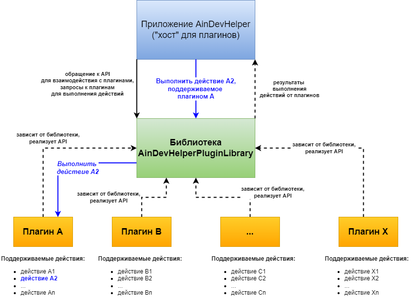

# AinDevHelperPluginLibrary

* **[Русский]** Вы просматриваете версию данного README на немецком языке. Вы также можете читать данное руководство на других языках.
* **[English]** You are viewing the German version of this README. You can also read this manual in other languages.
* **[Deutsch]** Sie sehen die deutsche Version dieser README-Datei. Sie können dieses Handbuch auch in anderen Sprachen lesen.

[Русский](README-ru.md) | [English](README.md)

## Was ist AinDevHelperPluginLibrary?

**AinDevHelperPluginLibrary** ist eine in C# unter Verwendung des .NET Framework 4.7.2 entwickelte Bibliothek, die Entwicklern 
die notwendigen Tools und *Application Programming Interface* (API) zur Verfügung stellt, um ihre eigenen Erweiterungen (*Plugins*) zu erstellen, 
die auf die Zusammenarbeit zugeschnitten sind mit dem AinDevHelper-Programm („Developer Assistant“), das als *Host* für solche Plugins fungiert.

Plugins, die mit der **AinDevHelperPluginLibrary**-Bibliothek entwickelt wurden und im AinDevHelper-Programm funktionieren sollen, können in Sprachen 
geschrieben werden, die von .NET Framework 4.7.2 unterstützt werden.

Plugins sind in der Lage, verschiedene *Aktionen* zu unterstützen, deren Implementierungs- und Ausführungslogik tatsächlich die Besonderheiten 
und Funktionalität jedes einzelnen Plugins darstellt. Die Implementierung der vom Plugin unterstützten Aktionen ist in der Programmiersprache geschrieben, 
in der das Plugin entwickelt wurde.

Wenn Sie ein Plugin für AinDevHelper entwickeln, sollten Sie eine Abhängigkeit von der **AinDevHelperPluginLibrary**-Bibliothek hinzufügen und die 
von der Bibliothek bereitgestellte API implementieren.

## Interaktionsdiagramm und Funktionsprinzip

Nachfolgend finden Sie eine schematische Darstellung des Grundprinzips der Funktionsweise und des Zusammenspiels der drei im Diagramm dargestellten Komponententypen:

* *Die **AinDevHelper***-Anwendung, die als *Host* für damit kompatible Plugins fungiert
* *Library **AinDevHelperPluginLibrary***, die als eine Art „Brücke“ zwischen dem *Host* und unterstützten Plugins fungiert. Die Kommunikation zwischen dem Host und den Plugins erfolgt über eine gemeinsame API, die sowohl vom Host als auch von den Plugins verwendet wird.
* *Eine Reihe von Plugins*, die von der AinDevHelper-Anwendung unterstützt werden und mit ihr kompatibel sind – durch die Implementierung der von der AinDevHelperPluginLibrary-Bibliothek bereitgestellten API

