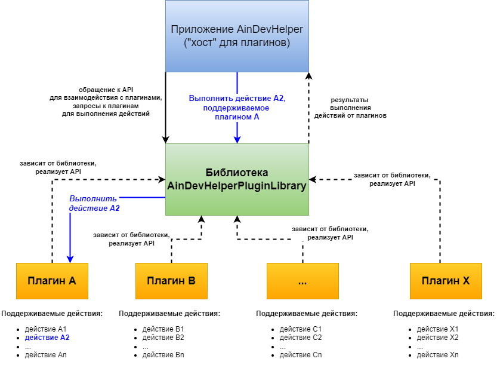

# AinDevHelperPluginLibrary

* **[Русский]** Вы просматриваете версию данного README на русском языке. Вы также можете читать данное руководство на других языках.
* **[English]** You are viewing the Russian version of this README. You can also read this manual in other languages.
* **[Deutsch]** Sie sehen sich die russische Version dieser README-Datei an. Sie können dieses Handbuch auch in anderen Sprachen lesen.

[English](README.md) | [Deutsch](README-de.md)

## Что такое AinDevHelperPluginLibrary?

**AinDevHelperPluginLibrary** - это библиотека, разработанная на языке C# с использованием платформы .NET Framework 4.7.2, которая 
предоставляет разработчикам необходимые средства и *прикладной программный интерфейс* (API) для создания собственных расширений (*плагинов*), 
адаптированных для работы совместно с программой AinDevHelper ("Помощник Разработчика"), которая выступает в роли *хоста* для таких плагинов.

Плагины, разработанные с использованием библиотеки **AinDevHelperPluginLibrary** и предназначенные для 
работы в программе AinDevHelper, могут быть написаны на языках, поддерживаемых платформой .NET Framework 4.7.2.

Плагины способны поддерживать различные *действия*, реализация и логика выполнения которых, по сути, является спецификой и функциональностью 
каждого отдельно взятого плагина. Реализация действий, поддерживаемых плагином, пишется на том языке программирования, на котором разрабатывается плагин.

При разработке плагина для AinDevHelper следует добавить зависимость на библиотеку **AinDevHelperPluginLibrary** и 
реализовать API, предоставляемый библиотекой.

## Схема взаимодействия и принцип работы

Ниже схематично представлен основной принцип работы и взаимодействия трёх типов компонентов, представленных на диаграмме:

* *Приложение **AinDevHelper***, которое выступает в роли *хоста* для совместимых с ним плагинов
* *Библиотека **AinDevHelperPluginLibrary***, выступающая в роли своеобразного "моста" между *хостом* и поддерживаемыми плагинами. Взаимодействие между хостом и плагинами осуществляется посредством общего API, которое использует как хост, так и плагины.
* *Набор плагинов*, поддерживаемых приложением AinDevHelper и совместимых с ним, - за счёт реализации API, предоставляемого библиотекой AinDevHelperPluginLibrary

