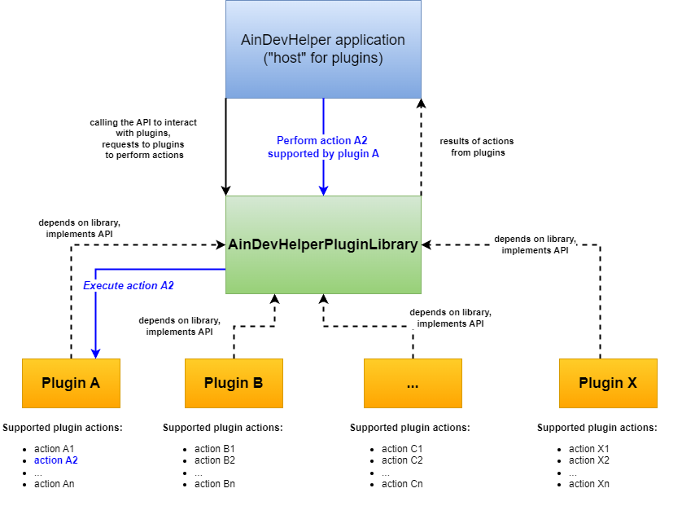

# AinDevHelperPluginLibrary

* **[Русский]** Вы просматриваете версию данного README на английском языке. Вы также можете читать данное руководство на других языках.
* **[English]** You are viewing the English version of this README. You can also read this manual in other languages.
* **[Deutsch]** Sie sehen sich die englische Version dieser README-Datei an. Sie können dieses Handbuch auch in anderen Sprachen lesen.

[Русский](README-ru.md) | [German](README-de.md)

## What is AinDevHelperPluginLibrary?

**AinDevHelperPluginLibrary** is a library developed in C# using the .NET Framework 4.7.2 platform, which provides developers 
with the necessary tools and *application programming interface* (API) to create their own extensions (*plugins*) adapted to work 
in conjunction with the **AinDevHelper** program ("Developer Helper"), which acts as a *host* for such plugins.

Plugins developed using the **AinDevHelperPluginLibrary** library and intended to work in the AinDevHelper program 
can be written in languages ​​supported by the .NET Framework 4.7.2.

Plugins are capable of supporting various *actions*, the implementation and execution logic of which, in fact, is the 
specifics and functionality of each individual plugin. The implementation of actions supported by the plugin is written in the 
programming language in which the plugin is developed.

When developing a plugin for AinDevHelper, you should add a dependency on the **AinDevHelperPluginLibrary** library and implement 
the API provided by the library.

## Interaction diagram and operating principle

Below is a schematic representation of the basic principle of operation and interaction of the three types of components shown in the diagram:

* *The **AinDevHelper*** application, which acts as a *host* for plugins compatible with it
* ***AinDevHelperPluginLibrary** library*, acting as a kind of “bridge” between the *host* and supported plugins. Communication between the host and plugins is accomplished through a common API that is used by both the host and the plugins.
* *A set of plugins* supported by and compatible with the AinDevHelper application - through the implementation of the API provided by the AinDevHelperPluginLibrary library

